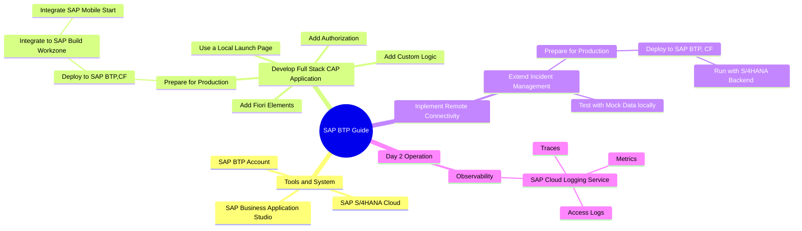
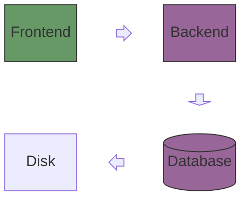
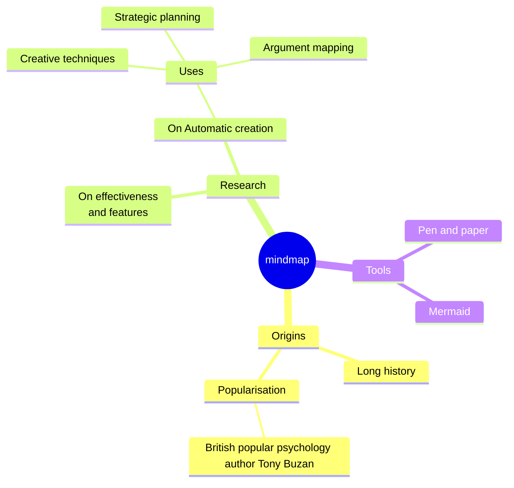
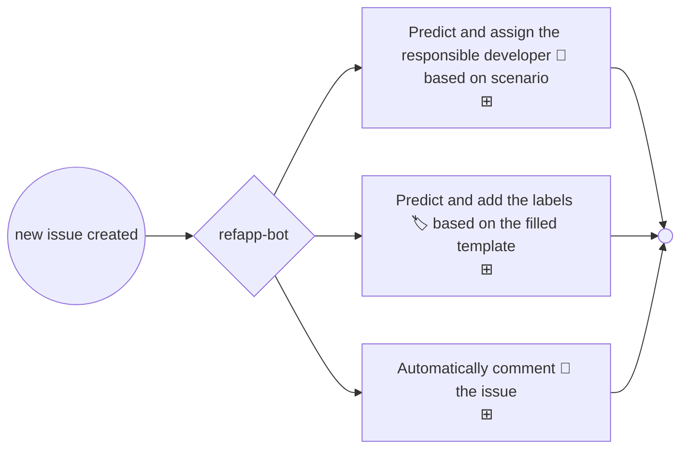

<h1 align="center">refapp-bot 🤖</h1>
<h2 align="center">Track :octocat: Validation Issue</h2>





```mermaid
journey
    SAP BTP Developer Guide
    section Develop Full Stack CAP Application
      Develop CAP+Fiori: 5: Me
      Prepare for Production: 3: Me
      Deploy to SAP BTP,CF: 1: Me, Cat
    section Implement Remote Connectivity
      Extend Application: 5: Me
      Test Locally: 5: Me
      Prepare and Deploy: 5: Me
      Run with S/4HANA Backend: 5: Me 
    section Day 2 Operation
      SAP Cloud Logging Service: 5: Me
      Access Logs,Metrics and Traces: 5: Me
```







## Feature



> [!NOTE]  
> More customize feature is in progress!!!!!!

> [!IMPORTANT]  
> Bot is to be customized based on speicifc use case.

> [!WARNING]  
> Don't try to use the bot without permission.

> [!CAUTION]
> Negative potential consequences of an action.

