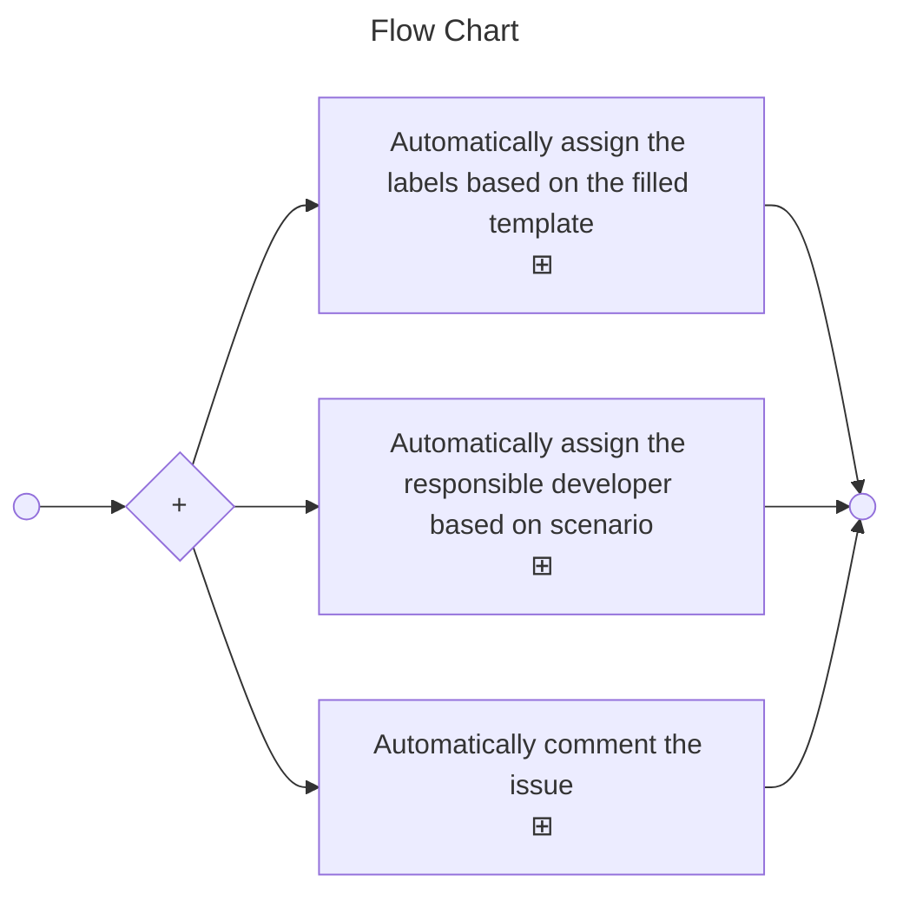

<h1 align="center">refapp-bot</h1>
<h2 align="center">Bot to track validation issue</h2>

## Feature

> [!NOTE]  
> More customize feature is in progress!!!!!!

> [!IMPORTANT]  
> Bot is to e customized based on speicifc use case.

> [!WARNING]  
> Don't try to use the bot without permission.

> [!CAUTION]
> Negative potential consequences of an action.

